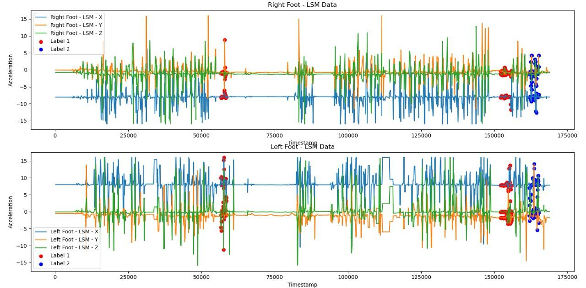
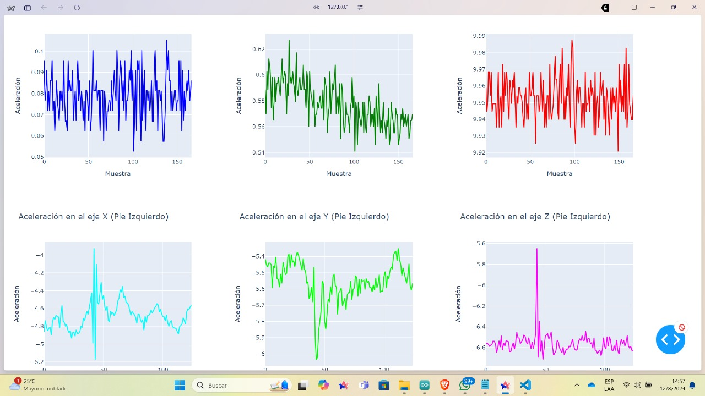
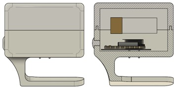
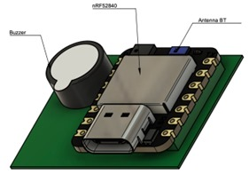

# Proyecto de Detección de Congelamiento de la Marcha (CDM)
Esta guía proporciona los pasos necesarios para configurar y utilizar el proyecto basado en el Seeed XIAO nRF52840 Sense.
El proyecto tiene como objetivo detectar el Congelamiento de la Marcha en pacientes mediante el uso de sensores.

## Guía de Configuración y Uso del Proyecto con Seeed XIAO nRF52840 Sense

## Descripción de los Archivos

### 1. Datos.py
Este archivo se encarga de cargar y graficar los datos de un archivo CSV, recopilados por el sensor integrado en el MCU Seeed XIAO nRF52840 Sense. Utiliza pandas para la manipulación de datos y matplotlib para las visualizaciones.

**Funciones Principales:**
- Cargar datos desde un archivo CSV especificado por la ruta `file_path`.
- Graficar los datos de un sensor específico en función del tiempo para los ejes X, Y, y Z.

#### Imagen de la salida del sensor:


### 2. MCU_ACC.ino
Este archivo contiene un sketch para la plataforma Arduino que se ejecuta en el MCU Seeed XIAO nRF52840 Sense. Está configurado para interactuar con un sensor LSM6DS3 y enviar datos mediante Bluetooth Low Energy (BLE).

**Componentes Utilizados:**
- **LSM6DS3:** Sensor de movimiento que proporciona datos de aceleración y giroscopio.
- **Bluetooth LE:** Para transmitir datos a dispositivos conectados.

**Configuraciones y Funciones Principales:**
- Inicialización del sensor y configuración para la comunicación I2C.
- Configuración de servicios y características BLE para la transmisión de datos.
- Callbacks para manejar conexiones y desconexiones BLE.

Para más información sobre la configuración del MCU Seeed XIAO nRF52840 Sense en Arduino IDE, visita esta [página](#).

### 3. Servidor.py
Este archivo implementa un servidor utilizando Dash para la visualización de datos y Bleak para la comunicación con dispositivos BLE. Permite la conexión a dispositivos BLE, recopila datos y los visualiza en un dashboard web.

**Funciones Principales:**
- Conexión a dispositivos BLE usando direcciones MAC especificadas.
- Recolección de datos de sensores y visualización en tiempo real.
- Manejo de conexiones BLE y procesamiento de los datos recibidos.

#### Vista preliminar del servidor:


Además, en el servidor se realiza la etiquetación de datos y se permite la descarga del archivo CSV de los datos tomados.

### 4. Machine Learning
Esta sección describe cómo se aplican modelos de Machine Learning a los datos recolectados por los sensores para la clasificación de actividades o comportamientos. Se utilizan dos enfoques:

**Uso de Características Extraídas con TSFresh:**
- Se aplica extracción de características con `tsfresh` para los datos de sensores.
- Se dividen los datos en ventanas y subventanas para capturar patrones temporales.
- Se entrena un modelo `ExtraTreesClassifier` para evaluar la importancia de características.

**Modelo Directo con Datos Sin Extracción de Características:**
- Los datos de sensores se usan directamente sin extracción previa de características, adecuado para aplicaciones embebidas debido a la menor carga computacional.
- Se entrena y evalúa una variedad de modelos (RandomForest, SVM, KNeighbors) utilizando los datos originales.

**Resultados:**
- El enfoque sin extracción de características proporcionó mejores resultados y es más adecuado para la implementación en MCUs por la simplicidad de procesamiento.

**Modelos y Evaluaciones:**
- Modelos evaluados: `RandomForestClassifier`, SVM, `KNeighborsClassifier`.
- Se utilizaron métricas de rendimiento como precisión y la matriz de confusión para evaluar los modelos.
- La visualización de las importancias de características y los reportes de clasificación permiten interpretar los resultados obtenidos.

## Instalación de Dependencias
Para ejecutar los scripts correctamente, asegúrate de instalar las bibliotecas de Python y herramientas necesarias para Arduino.

### Instalación de Bibliotecas de Python
Ejecuta los siguientes comandos en tu terminal para instalar las bibliotecas necesarias:

```bash
pip install pandas matplotlib dash plotly bleak tsfresh scikit-learn seaborn

### Configuración del Entorno de Arduino
- **Instala Arduino IDE:** Descárgalo desde [Arduino IDE](https://www.arduino.cc/en/software).
- **Instala las bibliotecas requeridas en Arduino IDE:**
  - **Adafruit Bluefruit nRF52:** Para el manejo del módulo Bluetooth del Seeed XIAO nRF52840 Sense.
  - **SparkFun LSM6DS3:** Para la comunicación con el sensor LSM6DS3 utilizado en este proyecto.

### Programación del MCU Seeed XIAO nRF52840 Sense
1. **Conecta tu MCU a la computadora** usando un cable USB.
2. **Abre el archivo `MCU_ACC.ino` en Arduino IDE.**
3. **Selecciona la placa correcta** en **Herramientas > Placa > Seeed XIAO nRF52840 Sense**.
4. **Selecciona el puerto correcto** en **Herramientas > Puerto**.
5. **Sube el sketch al MCU** presionando el botón de subir (ícono de flecha derecha) en Arduino IDE.

## Ejecución de los Scripts

### 1. Ejecución de `Datos.py`
Para graficar los datos, asegúrate de tener el archivo CSV disponible en la ruta especificada en el script y luego ejecuta:

```bash
python Datos.py

Este comando cargará los datos del CSV y generará gráficos que muestran los valores del sensor a lo largo del tiempo para los ejes X, Y, y Z.

### 2. Ejecución de Servidor.py
Para iniciar el servidor de visualización de datos, utiliza el siguiente comando:

```bash
python Servidor.py

Este comando iniciará un servidor web accesible a través de tu navegador para visualizar los datos recolectados desde los dispositivos BLE conectados. En el servidor, podrás realizar la etiquetación de datos y descargar el archivo CSV de los datos tomados.

## Conexión y Configuración del Hardware

### Conexión del LSM6DS3
- Conecta el sensor LSM6DS3 a los pines I2C del Seeed XIAO nRF52840 Sense (SDA y SCL).
- Asegúrate de que los pines de alimentación (VCC y GND) estén correctamente conectados al MCU.

### Configuración de Bluetooth
- El MCU Seeed XIAO nRF52840 Sense transmitirá datos a dispositivos habilitados para Bluetooth Low Energy (BLE), conforme a la configuración especificada en el código `MCU_ACC.ino`.
- Asegúrate de que los dispositivos BLE estén encendidos, dentro del rango de conexión, y que la dirección MAC configurada en `Servidor.py` coincida con la del dispositivo al que te deseas conectar.

## Case Diseñado con Fusion 360
En el repositorio, encontrarás un diseño de case creado con Fusion 360 para proteger la PCB y el sensor. Hay dos bases diferentes disponibles:
1. **Base para el tobillo:** Diseñada para colocarse directamente en el tobillo del paciente.
2. **Base con cinta velcro:** Diseñada para sujetarse alrededor de la pantorrilla del paciente.

Las imágenes a continuación muestran los diseños del case:

- 
- 
- 

### PCB Diseñada en Altium Designer
La PCB fue diseñada utilizando Altium Designer. En el repositorio, encontrarás el proyecto de Altium y los archivos Gerber necesarios para su fabricación.

Imágenes de la PCB:

- 
- 

## Notas y Consideraciones
- Asegúrate de que los dispositivos BLE estén correctamente configurados y dentro del rango de conexión.
- Verifica que las direcciones MAC y UUIDs en `Servidor.py` coincidan con los dispositivos que deseas conectar.
- Revisa los resultados de los modelos de Machine Learning para asegurarte de que se ajusten a los requerimientos de precisión y rendimiento del proyecto.

## Conclusión
Esta guía proporciona una descripción detallada de cómo configurar y utilizar el proyecto basado en el Seeed XIAO nRF52840 Sense. Siguiendo los pasos y utilizando los recursos proporcionados en el repositorio, podrás desplegar con éxito la solución para la recopilación y análisis de datos de sensores utilizando BLE y Machine Learning.


## Hardware

Este proyecto utiliza una PCB diseñada específicamente para el Seeed XIAO nRF52840 Sense. La placa incluye:

- **Conexiones:** Pines para la conexión de sensores adicionales, como acelerómetros o giroscopios.
- **Alimentación:** Conexión para baterías LiPo, lo que permite portabilidad.
- **Caja:** El dispositivo está protegido por un case impreso en 3D, diseñado para ser compacto y cómodo de usar en el talón del paciente.

### Imágenes de la PCB y el case:


